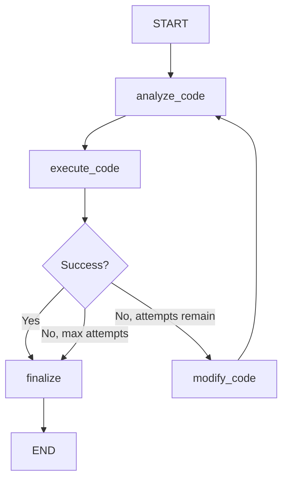

# Code_Eval Architecture

## Overview

Code_Eval is a multi-agent code improvement system built on **LangGraph**, following official best practices from [LangGraph Documentation](https://docs.langchain.com/oss/python/langgraph/).

## Core Components

### 1. Agents (`agent/`)

Three specialized agents handle different aspects of code improvement:

#### CodeAnalyzerAgent
- **Purpose**: Analyzes code structure, quality, and identifies issues
- **Model Type**: Default (balanced performance)
- **Tools**: File reading, code analysis, MCP tools (if enabled)
- **Output**: Code analysis, identified issues list

#### CodeExecutorAgent
- **Purpose**: Executes code and captures results/errors
- **Model Type**: Fast (quick execution checks)
- **Tools**: Python code execution, file execution, error analysis
- **Output**: Execution results, success status, error details

#### CodeModifierAgent
- **Purpose**: Modifies code to fix identified issues
- **Model Type**: Powerful (complex reasoning for fixes)
- **Tools**: File writing, code modification, MCP tools (if enabled)
- **Output**: Modified code, change history

### 2. Workflow (`workflow/`)

#### LangGraph Workflow Pattern



#### Key Features

**Memory/Persistence**:
- **Development**: `MemorySaver` (in-memory checkpointing)
- **Production**: `SqliteSaver` (persistent checkpointing)
- Enables resuming workflows, handling interruptions
- Reference: [LangGraph Add Memory](https://docs.langchain.com/oss/python/langgraph/add-memory)

**Thread ID Support**:
- Multiple concurrent sessions
- Each workflow run has unique thread ID
- State isolation between sessions

**Streaming**:
- Real-time state updates
- Progress monitoring
- Better user experience

### 3. State Management (`agent/state.py`)

Following LangGraph best practices:

```python
from typing_extensions import TypedDict
from langgraph.graph import add_messages

class MultiAgentState(TypedDict):
    # Properly annotated messages for LangGraph
    messages: Annotated[List[AnyMessage], add_messages]
    
    # All other state fields
    target_file: str
    execution_attempts: int
    # ... more fields
```

**Why TypedDict**:
- LangGraph requirement for proper state management
- Better type checking and IDE support
- Enables proper state updates via reducers

### 4. Tools (`tools/`)

#### Built-in Tools (`code_tools.py`)
- `read_file_tool`: Read file contents
- `write_file_tool`: Write to files
- `execute_python_code`: Execute Python code snippets
- `execute_file`: Execute Python files
- `analyze_error`: Analyze error messages
- `search_code`: Search for terms in code

#### MCP Integration (`mcp_integration.py`)
- **Purpose**: Integrate external tools via Model Context Protocol
- **Support**: HTTP and stdio transports
- **Configuration**: Environment-based setup
- **Reference**: [LangChain MCP](https://docs.langchain.com/oss/python/langchain/mcp)

```python
# Example MCP configuration
MCP_ENABLED=true
MCP_SERVER_URL=http://localhost:8000/mcp
MCP_FILESYSTEM_PATH=/tmp
```

### 5. Configuration (`config/`)

Centralized configuration management:

```python
# LLM Providers
DEFAULT_PROVIDER = "openrouter"  # Pre-configured

# Memory/Checkpointing
USE_SQLITE_CHECKPOINTER = false  # In-memory by default
SQLITE_DB_PATH = "checkpoints.db"

# MCP
MCP_ENABLED = false  # Disabled by default
```

### 6. Prompts (`prompt/`)

Centralized system prompts for:
- Code analysis instructions
- Execution guidelines
- Modification best practices

## Design Patterns

### 1. Agent Pattern

Following [LangGraph Agent Pattern](https://docs.langchain.com/oss/python/langgraph/workflows-agents):

- Each agent is autonomous with specific tools
- Agents use tool calling to perform actions
- LLM decides which tools to use
- Results feed back into agent reasoning

### 2. Workflow Pattern

Predetermined flow with conditional branches:

```python
workflow.add_conditional_edges(
    "execute_code",
    should_continue,  # Decision function
    {
        "modify": "modify_code",
        "finalize": "finalize"
    }
)
```

### 3. State Reducer Pattern

Messages use `add_messages` reducer for proper appending:

```python
messages: Annotated[List[AnyMessage], add_messages]
```

This ensures messages are properly accumulated across nodes.

## Data Flow

1. **Initialize State**:
   ```python
   initial_state = create_initial_state(
       target_file="script.py",
       initial_code="...",
       max_attempts=5
   )
   ```

2. **Invoke with Config**:
   ```python
   config = {"configurable": {"thread_id": "unique_id"}}
   result = graph.invoke(initial_state, config)
   ```

3. **State Updates**:
   - Each node returns partial state updates
   - LangGraph merges updates into current state
   - Checkpointer saves state after each node

4. **Resume from Checkpoint**:
   ```python
   # Resume with same thread_id
   result = graph.invoke(None, config)
   ```

## Scalability Considerations

### Current Architecture (Single Workflow)

- ✅ Good for: Single file code improvement
- ✅ Clear linear flow with feedback loop
- ✅ Sufficient for most use cases

### When to Add Subgraphs

Consider subgraphs when:
- Processing multiple files simultaneously
- Need hierarchical agent coordination
- Complex branching logic per agent
- Reference: [LangGraph Subgraphs](https://docs.langchain.com/oss/python/langgraph/use-subgraphs)

**Example Subgraph Use Case**:
```python
# Main graph coordinates file processing
main_graph = StateGraph(...)

# Subgraph handles single file improvement
file_improvement_subgraph = StateGraph(...)
file_improvement_subgraph.add_node("analyze", ...)
file_improvement_subgraph.add_node("execute", ...)
file_improvement_subgraph.add_node("modify", ...)

# Add compiled subgraph as node to main graph
main_graph.add_node("improve_file", file_improvement_subgraph.compile())
```

## Configuration Management

### Development vs Production

**Development**:
```bash
# In-memory checkpointing
USE_SQLITE_CHECKPOINTER=false

# MCP disabled
MCP_ENABLED=false
```

**Production**:
```bash
# Persistent checkpointing
USE_SQLITE_CHECKPOINTER=true
SQLITE_DB_PATH=/data/checkpoints.db

# MCP enabled
MCP_ENABLED=true
MCP_SERVER_URL=https://mcp.example.com/api
```

## Best Practices Implemented

1. **Proper State Management**: Using TypedDict with annotations
2. **Memory/Persistence**: Checkpointer for state continuity
3. **Configuration-based Sessions**: Thread IDs for isolation
4. **Tool Integration**: Both built-in and MCP tools
5. **Error Handling**: Graceful degradation if MCP unavailable
6. **Streaming Support**: Real-time progress updates
7. **Modular Design**: Clear separation of concerns

## References

- [LangGraph Workflows & Agents](https://docs.langchain.com/oss/python/langgraph/workflows-agents)
- [LangGraph Add Memory](https://docs.langchain.com/oss/python/langgraph/add-memory)
- [LangGraph Subgraphs](https://docs.langchain.com/oss/python/langgraph/use-subgraphs)
- [LangChain MCP](https://docs.langchain.com/oss/python/langchain/mcp)

